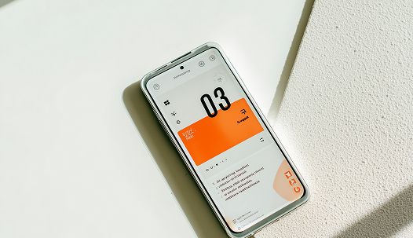

# Nelson Portfolio 網站作業學習紀錄

## 作業主題

這次作業是製作一頁式個人作品集網站，主題是 `Nelson | Portfolio`。網站內容包含頁首導覽列、Hero 主視覺、服務項目、專案作品、部落格區塊，以及頁尾聯絡表單。

在練習過程中，我主要學習如何把設計稿拆成 HTML 結構，再用 CSS class 做版面、顏色、字級、間距與 RWD 響應式調整，最後加入少量 JavaScript 讓手機版導覽列和服務卡片滑動可以互動。

## 我完成的網站結構

這份作業主要分成幾個區塊：

- `header`：放置網站 Logo、導覽列與手機版漢堡選單。
- `hero-main`：放置首頁主標題、簡介文字、按鈕與人物圖片。
- `hero-service`：製作服務項目卡片，包含平面設計、網頁設計、前端切版、後端開發。
- `projects-section`：製作專案作品列表，使用背景圖片搭配文字卡片。
- `blog-section`：先建立部落格區塊的基本架構。
- `footer`：放置聯絡資訊、社群連結與聯絡表單。

## HTML 學習過程

一開始我先建立 `index.html`，並把網站分成清楚的區塊。這讓我練習到語意化標籤的使用，例如 `header`、`nav`、`section`、`footer`、`form`、`input`、`textarea`。

在寫 HTML 時，我也練習用 class 來標記每個元素的用途，例如：

- `container` 控制內容寬度。
- `d-flex` 控制 Flex 排版。
- `col-5`、`col-7`、`col-3` 控制欄位比例。
- `heading-xxxl`、`paragraph-md` 控制文字大小。
- `bg-primary-50`、`text-neutral-700` 控制顏色。

這次我學到，HTML 不只是把文字放上去，而是要先想清楚每個區塊的層級和用途。結構整理清楚後，後面寫 CSS 會比較容易。

## CSS 學習過程

這次 CSS 分成三個檔案：

- `static/reset.css`：先把瀏覽器預設樣式重置，避免不同瀏覽器顯示不一致。
- `static/base.css`：放共用設定，例如色票、字級、間距、Flex、欄位系統、按鈕樣式。
- `static/index.css`：放這一頁專屬的區塊樣式，例如服務卡片、專案背景圖、手機版選單。

我在 `base.css` 裡建立了很多工具型 class，像是 `py-12`、`px-24`、`mb-24`、`rounded-full`、`text-center`。這讓我可以在 HTML 裡快速組合樣式，不用每個區塊都重新寫一次 CSS。

我也學到 CSS 變數的使用，例如：

- `--color-primary-50`
- `--color-primary-900`
- `--color-neutral-700`
- `--gutter`
- `--column`

用變數管理顏色和欄位設定，可以讓網站風格更一致，也方便之後修改。

## 排版與 RWD 練習

這次作業最重要的練習之一是 RWD 響應式設計。我用 `@media` 針對不同螢幕寬度調整版面。

桌機版主要使用左右欄排版，例如 Hero 區塊左邊放文字、右邊放圖片；手機版則改成上下排列，並透過 `order-md-1`、`order-md-2` 調整圖片和文字的順序。

服務項目在桌機版是四張卡片並排，到了手機版改成可以水平滑動的卡片列表。專案區在桌機版使用大張背景圖搭配文字卡片，手機版則改成圖片在上、文字卡片在下，讓小螢幕比較好閱讀。

這次我練習到：

- 使用 `flex-direction` 控制橫向或直向排列。
- 使用 `width` 和 `calc()` 製作欄位比例。
- 使用 `gap` 控制項目之間的距離。
- 使用 `background-image`、`background-size`、`background-position` 製作專案圖片區。
- 使用 `@media (max-width: 992px)` 調整手機與平板版面。

## JavaScript 學習過程

這次 JavaScript 寫在 `index.js`，主要處理兩個互動功能。

第一個是手機版漢堡選單。按下 `.menu-btn` 後，會切換 `.navList` 的 `active` class，讓選單顯示或隱藏；同時也會切換 `body` 的 `menu-open` class，讓背景遮罩出現。

第二個是服務項目的手機版滑動按鈕。點擊上一張或下一張按鈕時，會用 `scrollBy()` 讓服務卡片水平移動。

這次我學到 JavaScript 可以先不用寫得很複雜，只要搭配 HTML class 和 CSS 狀態，就能做出基本互動效果。

## 遇到的問題與學到的解法

### 1. 桌機版和手機版版面不同

一開始同一套版面很難同時適合桌機和手機。後來我用 `@media` 分開處理不同螢幕寬度，並使用 `flex-md-col`、`col-md-12` 這類 class 讓手機版改成單欄。

### 2. 手機版導覽列需要開合

導覽列在桌機版可以直接顯示，但手機版需要收合。我用 `.navList.active` 控制顯示狀態，再用 JavaScript 點擊按鈕切換 class。

### 3. 服務卡片在小螢幕放不下

四張服務卡片在手機版如果硬塞進畫面會太擠，所以我改成水平滑動，並加入上一張、下一張按鈕，讓手機版閱讀起來比較舒服。

### 4. 共用樣式越寫越多

一開始可能會一直針對單一區塊寫 CSS，但後來發現很多樣式可以共用，例如間距、文字大小、顏色、圓角、Flex 排版。因此我把這些整理到 `base.css`，讓 HTML 可以重複使用同一套 class。

## 這次作業的收穫

完成這份網站作業後，我比較理解一個網頁從無到有的流程：

1. 先觀察設計稿，拆出頁首、主視覺、內容區、頁尾。
2. 用 HTML 建立清楚的結構。
3. 用 reset CSS 統一瀏覽器預設樣式。
4. 建立共用 class，讓顏色、字級、間距一致。
5. 用 Flex 和欄位系統完成桌機版排版。
6. 用 media query 調整手機版版面。
7. 用少量 JavaScript 加入選單與滑動互動。

這次不只是練習把畫面做出來，也開始理解「結構、樣式、互動」三者之間的關係。

## 後續可以加強的地方

之後如果要繼續優化這份作業，我會優先檢查這幾個地方：

- 檢查 HTML 標籤是否都有正確關閉。
- 補上更完整的圖片 `alt` 文字。
- 將導覽列連結改成可以跳到對應區塊。
- 統一 class 命名，例如確認 `label` 和 `lable` 是否需要修正。
- 讓部落格區塊補上完整卡片內容。
- 檢查手機版表單、按鈕、卡片文字是否都有良好的間距。

## 總結

這次網站作業讓我練習到 HTML 結構、CSS class 管理、RWD 響應式設計，以及基本 JavaScript 互動。雖然還有一些細節可以繼續調整，但我已經能夠把一個完整的一頁式作品集網站拆解成不同區塊，並用 HTML、CSS、JavaScript 一步步完成。

# 2026/6/18 Nelson Portfolio 網站作業學習紀錄

## 今日學習主題

今天主要延續 Nelson Portfolio 個人作品集網站，重點放在「部落格區塊」的製作與互動功能。前面已經有頁首、Hero、服務項目、專案作品和頁尾，今天進一步把 `BLOGS` 區塊補得更完整，並嘗試加入左右滑動按鈕，讓部落格卡片可以像輪播一樣移動。

今天練習的檔案主要有：

- `index.html`：新增與調整部落格區塊的 HTML 結構。
- `static/index.css`：撰寫部落格卡片、滑動區、按鈕與 RWD 樣式。
- `button.js`：練習用 JavaScript 控制部落格列表左右滑動。
- `images/`：放入部落格文章圖片素材。

## 今日完成的內容

### 1. 新增部落格區塊內容

今天在 `index.html` 裡把原本比較簡單的部落格區塊，整理成比較完整的文章卡片列表。

部落格區塊包含：

- 區塊標題：`部落格`、`BLOGS`
- 探索更多按鈕
- 左右切換按鈕
- 多張部落格文章卡片
- 文章圖片
- 文章分類
- 文章標題
- 日期、觀看數、分享數等資訊

這次練習到 `section`、`article`、`img`、`h3`、`p`、`span`、`button` 這些 HTML 標籤的搭配使用，也更清楚文章卡片可以用 `article` 來表示一篇內容。

### 2. 加入圖片素材

今天新增了 `images` 資料夾，裡面放了部落格圖片素材：

- `blog_1.png`
- `blog_2.png`
- `blog_3.png`
- `blog_4.png`
- `blog_5.png`

在 HTML 裡使用：

```html

```

這讓我練習到圖片路徑的寫法，也知道專案內的圖片可以用相對路徑 `./images/...` 連到 HTML。

### 3. 建立部落格卡片版面

今天在 `static/index.css` 裡新增了部落格相關 class，例如：

- `blog-slider`
- `blog-list`
- `blog-card`
- `blog-image`
- `blog-content`
- `blog-card-title`
- `blog-meta`
- `blog-slider-button`

我用 `display: flex` 讓部落格卡片橫向排列，並用 `gap` 控制卡片之間的距離。

`blog-card` 使用固定寬度：

```css
.blog-card {
  flex: 0 0 360px;
}
```

這表示每張卡片不會被壓縮，寬度維持 360px，因此當卡片數量超過畫面寬度時，就可以形成橫向滑動的效果。

### 4. 練習 overflow 與橫向滑動

今天也練習到 `overflow-x` 的觀念。

在 `blog-list` 裡使用：

```css
.blog-list {
  display: flex;
  gap: 24px;
  overflow-x: auto;
  scroll-behavior: smooth;
}
```

這段的意思是：

- `display: flex`：讓文章卡片橫向排列。
- `gap: 24px`：讓卡片之間有距離。
- `overflow-x: auto`：當內容超出寬度時，可以水平捲動。
- `scroll-behavior: smooth`：滑動時有平順的動畫感。

後來又搭配左右按鈕，讓使用者不用自己拖拉，也可以點按鈕移動部落格列表。

### 5. 新增左右滑動按鈕

今天新增了兩個按鈕：

```html
<button class="blog-slider-button blog-slider-button-prev" type="button">＜</button>
<button class="blog-slider-button blog-slider-button-next" type="button">＞</button>
```

CSS 裡把按鈕做成圓形，並加上背景色、陰影、置中排列：

```css
.blog-slider-button {
  width: 48px;
  height: 48px;
  border-radius: 50%;
  background-color: var(--color-neutral-0);
  color: var(--color-neutral-500);
  box-shadow: 0 8px 20px rgba(0, 0, 0, 0.12);
  display: flex;
  align-items: center;
  justify-content: center;
  cursor: pointer;
  font-weight: 600;
}
```

這次學到按鈕不只是 HTML 元素，也可以透過 CSS 做出比較接近設計稿的視覺效果。

### 6. 使用 JavaScript 控制滑動

今天新增了 `button.js`，用 JavaScript 取得部落格列表和左右按鈕：

```js
const blogList = document.querySelector('.blog-list');
const prevButton = document.querySelector('.blog-slider-button-prev');
const nextButton = document.querySelector('.blog-slider-button-next');
```

接著用 `addEventListener` 監聽點擊事件，並用 `scrollBy()` 控制左右移動：

```js
prevButton.addEventListener('click', function () {
  blogList.scrollBy({
    left: -384,
    behavior: 'smooth'
  });
});

nextButton.addEventListener('click', function () {
  blogList.scrollBy({
    left: 384,
    behavior: 'smooth'
  });
});
```

今天學到：

- `querySelector()` 可以用 class 找到 HTML 元素。
- `addEventListener()` 可以讓按鈕被點擊時執行功能。
- `scrollBy()` 可以讓可捲動的區塊往左或往右移動。
- `behavior: 'smooth'` 可以讓滑動效果更自然。

## 今日遇到的問題與理解

### 1. 卡片要橫向排列，需要先讓外層成為 flex

如果只放很多 `article`，卡片會照 HTML 順序往下排列。今天透過 `.blog-list { display: flex; }` 讓卡片改成水平排列。

### 2. 卡片寬度不能被壓縮

如果卡片被 flex 自動壓縮，就不容易做出水平滑動效果。所以使用 `flex: 0 0 360px;`，讓每張卡片維持固定寬度。

### 3. 滑動距離要配合卡片寬度與間距

`button.js` 裡使用 `384` 作為滑動距離，是因為卡片寬度大約 360px，再加上卡片間距 24px，所以每次按按鈕大約移動一張卡片。

### 4. 手機版不一定需要顯示左右按鈕

在 CSS 裡使用：

```css
@media (max-width: 900px) {
  .blog-card {
    flex: 0 0 90%;
  }

  .blog-slider-button {
    display: none;
  }
}
```

手機版時，卡片寬度改成接近螢幕寬度，左右按鈕隱藏，讓使用者可以直接用手滑動。

## 今日學到的重點整理

今天的學習重點可以整理成以下幾點：

1. 部落格卡片可以用 `article` 製作，語意比單純使用 `div` 更清楚。
2. 圖片可以放在專案內的 `images` 資料夾，再用相對路徑連結。
3. `display: flex` 可以讓多張卡片橫向排列。
4. `overflow-x: auto` 可以讓超出範圍的內容水平捲動。
5. `scroll-behavior: smooth` 可以讓滑動比較順。
6. JavaScript 可以用 `querySelector()` 找到 class 元素。
7. JavaScript 可以用 `addEventListener()` 做點擊互動。
8. `scrollBy()` 可以控制區塊左右滑動。
9. RWD 可以讓桌機版顯示按鈕，手機版改成手指滑動。

## 後續可以修正與加強的地方

今天雖然完成了部落格區塊和滑動功能，但後續還可以繼續優化：

- 檢查部落格卡片裡的 `span` 標籤是否都有正確關閉。
- 讓每張部落格卡片使用不同圖片，例如 `blog_1.png` 到 `blog_5.png`。
- 把觀看數與分享數整理成更清楚的 HTML 結構。
- 檢查 `overflow-x: hidden` 和 `overflow-x: auto` 是否有重複設定。
- 補上 `.blog-image` 的寬度、圓角或比例設定，讓圖片尺寸更穩定。
- 在 JavaScript 裡加上元素是否存在的判斷，避免找不到按鈕時出錯。
- 繼續檢查手機版的部落格卡片是否好閱讀。

## 今日總結

今天 6/18 的學習重點是把部落格區塊從靜態內容，進一步做成可以橫向滑動的卡片列表。這次我不只練習 HTML 結構和 CSS 排版，也開始接觸 JavaScript 互動，理解 class、CSS 狀態和 JS 操作之間的關係。

今天完成後，我更清楚知道一個網站區塊可以分成三個部分來做：

1. HTML 負責內容與結構。
2. CSS 負責排版與視覺。
3. JavaScript 負責互動行為。

這次的部落格 slider 是一個很好的練習，因為它同時用到卡片排版、水平捲動、RWD 和按鈕互動。
